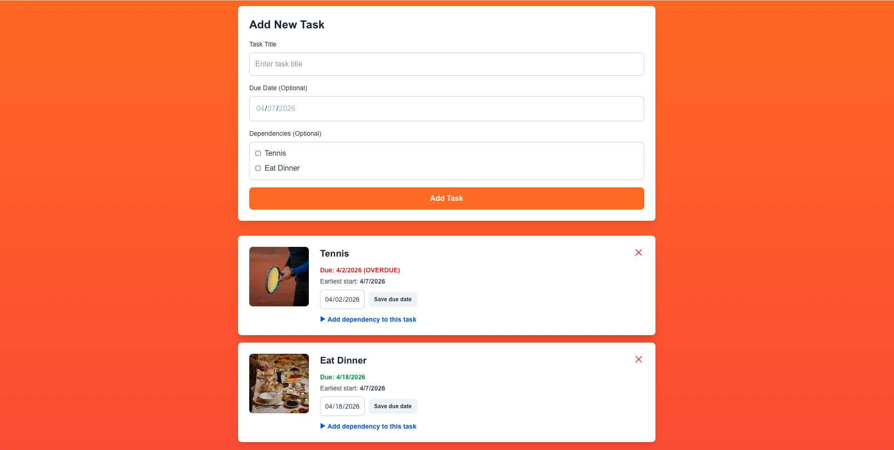
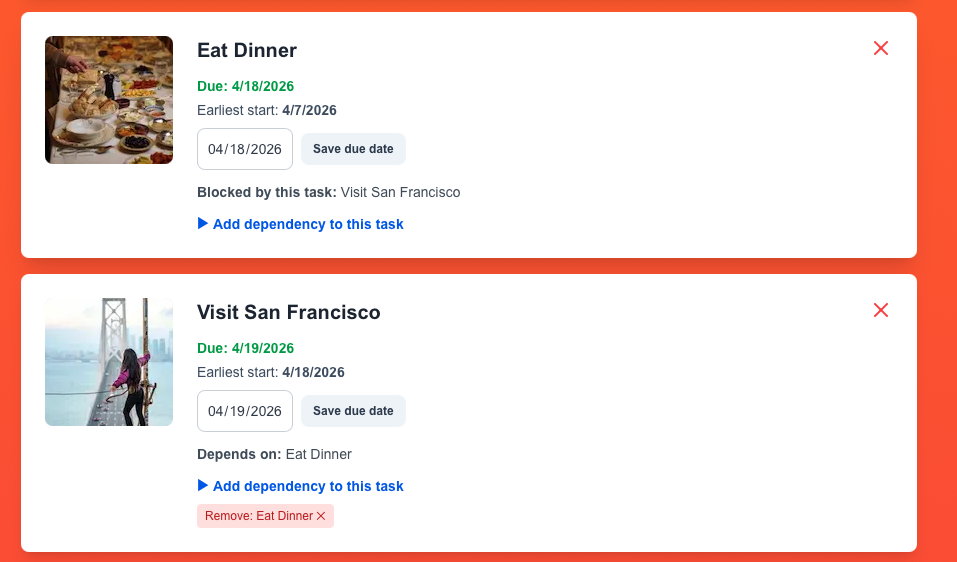
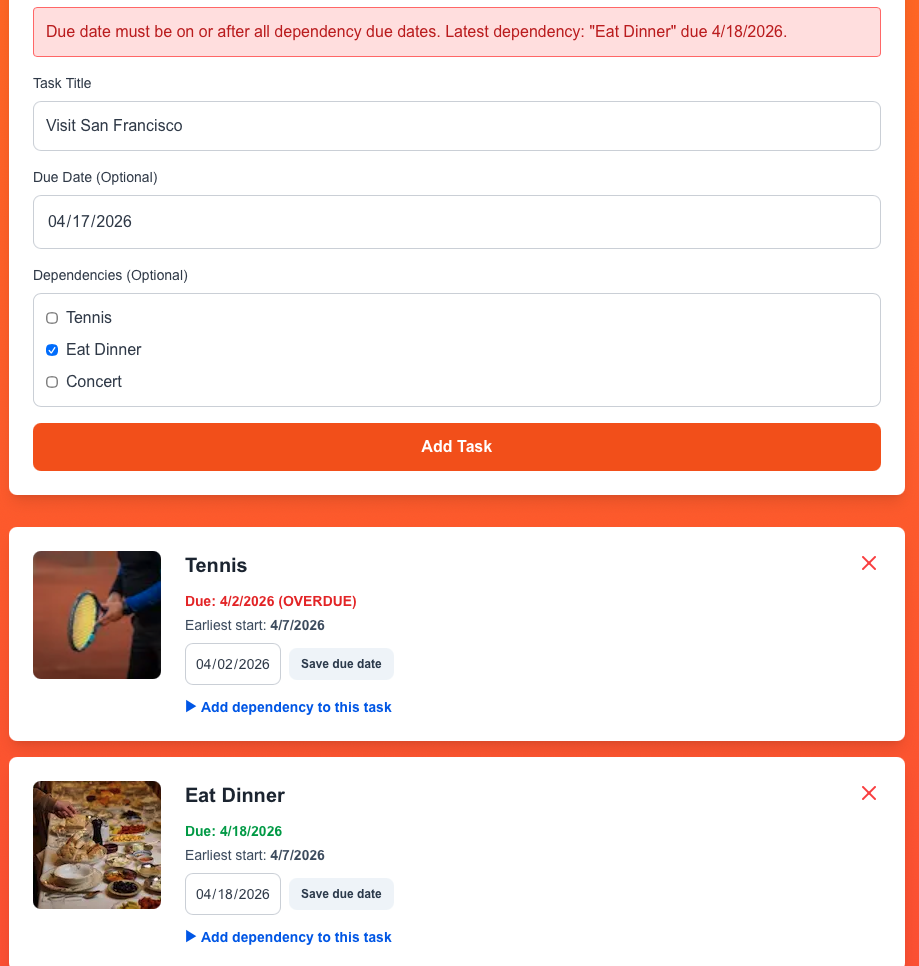
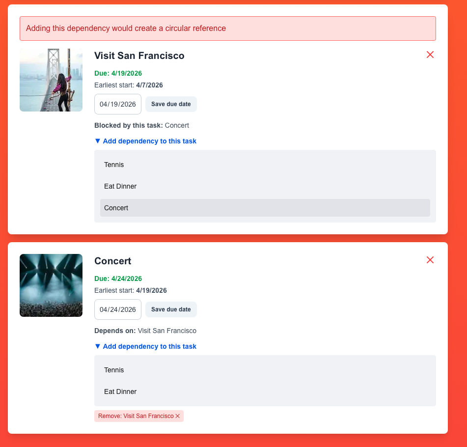
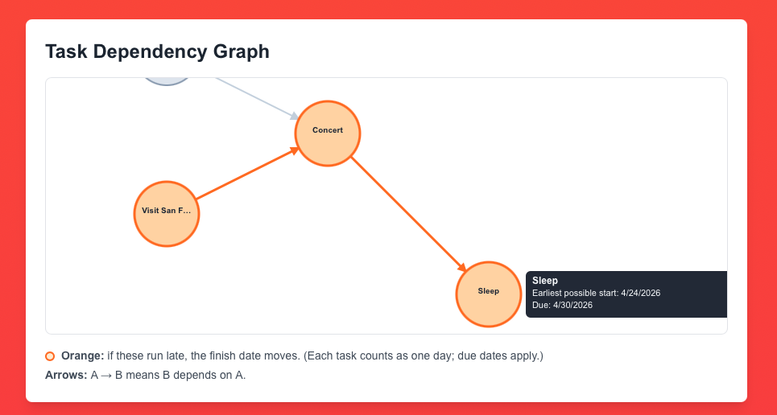

# Soma Capital Technical Assessment

This is a technical assessment as part of the interview process for Soma Capital.

> [!IMPORTANT]  
> You will need a Pexels API key to complete the technical assessment portion of the application. You can sign up for a free API key at https://www.pexels.com/api/

To begin, clone this repository to your local machine.

## Development

This is a [Next.js](https://nextjs.org) app with a SQLite backend, intended to be run with the LTS version of Node.

```bash
npm install
npx prisma migrate dev   # applies migrations; creates prisma/dev.db on first run
npm run dev

# Open [http://localhost:3000](http://localhost:3000).
```

**Quality checks:**

```bash
npm test          # vitest run
npm run lint      # ESLint (next/core-web-vitals)
npm run build     # production build + TypeScript check

# Optional: add `PEXELS_API_KEY` to `.env.local` for image previews.
```

---

## Provenance & auditability case study

Design write-up (investor + security lens) is in `docs/provenance-auditability-system.md`.

## Task

Modify the code to add support for **due dates**, **image previews**, and **task dependencies**.

### Part 1: Due dates

When a new task is created, users should be able to set a due date. 

When showing the task list is shown, it must display the due date, and if the date is past the current time, the due date should be in red.

### Part 2: Image generation

When a todo is created, search for and display a relevant image to visualize the task to be done.

To do this, make a request to the Pexels API using the task description as a search query. Display the returned image to the user within the appropriate todo item. While the image is being loaded, indicate a loading state.

You will need to sign up for a free Pexels API key to make the fetch request.

### Part 3: Task dependencies

Implement a task dependency system that allows tasks to depend on other tasks. The system must:

1. Allow tasks to have multiple dependencies
2. Prevent circular dependencies
3. Show the critical path
4. Calculate the earliest possible start date for each task based on its dependencies
5. Visualize the dependency graph


---

## Solution

### Quick start (clone → run → test)

```bash
git clone https://github.com/wliu14/soma-task-tracker
cd soma-task-tracker
npm install
npx prisma migrate dev
npm run dev          # app at http://localhost:3000
npm test             # automated tests
npm run lint         # ESLint
npm run build        # production build + typecheck
```

---

### Part 1 — Due Dates

- **Create:** TaskForm object that requires a title but optionally can include a due date and dependent TaskForm object
- **Enforce:** A task's cannot be before its dependency’s due date and cannot be after a dependent’s due date when those dates exist
- **Display:** Due date shown on the card with past dates use red styling and an “(OVERDUE)” label; future dates use green
- **Edit:** Give user's the ability to edit the due date and add / remove dependencies



**Primary files:** `app/components/TaskForm.tsx`, `app/components/TodoCard.tsx`, `app/api/todos/route.ts`, `app/api/todos/[id]/route.ts`, `lib/domain/todoRules.ts`

---

### Part 2 — Image Previews

- When user clicks on `Add Task`, it triggers **POST /api/todos** where the server makes an API Call to Pexels if key is present
- The first result is picked and stored as `imageUrl` on the `Todo`
- If there are issues or the image is loading a template "Couldn't load image" card is placed
- Gray frame shows while browser fetches the image or only if the request fails


**Primary files:** `app/api/todos/route.ts`, `app/components/TodoCard.tsx`, `next.config.mjs` (remote image host)

---

### Part 3 — Dependencies

- Multiple dependencies can be selected and removed when creating a new task or editing an existing one
- Dependencies resulting in cycles are prohibitted by performing a BFS on the graph and displaying an error message
- Enforcement is made on the due date of tasks by ensuring tasks have a later due date after their dependents 
- Interactive directed graph is present which displays the earliest start date and due date when a node is clicked on

(See Algorithms for more explanation on how this was done)






**Primary files:** `app/api/todos/[id]/dependencies/route.ts`, `app/components/DependencyGraph.tsx`, `lib/scheduling.ts`

---

### Database schema

**SQLite** via Prisma (`prisma/schema.prisma`). File DB: `prisma/dev.db` (gitignored).

| Model | Role |
|--------|------|
| **Todo** | Task: `title`, optional `dueDate`, optional `imageUrl`, `createdAt`. Relations: `dependsOn` (edges where this todo is the *dependent*), `dependedOnBy` (edges where this todo is the *dependency*). |
| **TodoDependency** | Directed edge: `dependentId` must wait on `dependencyId`. Unique on `(dependentId, dependencyId)`. Cascade delete when either todo is removed. |

```prisma
model Todo {
  id            Int              @id @default(autoincrement())
  title         String
  dueDate       DateTime?
  imageUrl      String?
  createdAt     DateTime         @default(now())
  dependsOn     TodoDependency[] @relation("DependentTodos")
  dependedOnBy  TodoDependency[] @relation("DependencyTodos")
}

model TodoDependency {
  id            Int   @id @default(autoincrement())
  dependentId   Int
  dependencyId  Int
  dependent     Todo  @relation("DependentTodos", fields: [dependentId], references: [id], onDelete: Cascade)
  dependency    Todo  @relation("DependencyTodos", fields: [dependencyId], references: [id], onDelete: Cascade)

  @@unique([dependentId, dependencyId], name: "TodoDependency_dependentId_dependencyId_key")
}
```

---

### API endpoints

| Method | Path | Purpose |
|--------|------|---------|
| `GET` | `/api/todos` | List todos with `dependsOn` / `dependedOnBy` nested |
| `POST` | `/api/todos` | Create todo; body: `title`, optional `dueDate` (`YYYY-MM-DD`), optional `dependencyIds[]` |
| `PATCH` | `/api/todos/[id]` | Update todo; body: `dueDate` (`YYYY-MM-DD` or null) |
| `DELETE` | `/api/todos/[id]` | Delete todo (cascades dependencies) |
| `GET` | `/api/todos/[id]/dependencies` | List dependency rows for todo `[id]` |
| `POST` | `/api/todos/[id]/dependencies` | Add dependency; body: `{ "dependencyId": number }` |
| `DELETE` | `/api/todos/[id]/dependencies` | Remove dependency; body: `{ "dependencyId": number }`. **404** if that edge does not exist. |

Errors use JSON `{ "error": string }` with 4xx/5xx as appropriate. Request bodies are validated in `lib/api/validation.ts`.

---

### Algorithms

**1) Circular Dependecy Check (Edge Insertion)**  
When adding edge `dependent -> dependency`, we test whether `dependency` can already reach `dependent` 

- Build adjacency matrix once with one `findMany` on `TodoDependency`.
- Run BFS over edges (task -> its dependencies).
- If reachable, reject the insert (it would create a cycle).

**2) Task Order (Kahn's Topological Sort)**  
We first build a DAG from dependency rows (`dependency -> dependent`) and compute each task's in-degree (how many prerequisites it has).

- Initialize a queue with all tasks whose in-degree is `0` (no prerequisites).
- Pop from the queue, append to `topologicalOrder`, and "remove" its outgoing edges.
- Each removed edge decrements a neighbor's in-degree; when that reaches `0`, enqueue it.

Why this matters in our project:
- This guarantees every task is processed only after all of its dependencies.
- We use `topologicalOrder` for the forward schedule pass and reverse order for the backward pass.

**3) Earliest Start Date**  
All schedule values are day offsets from `baseDate` (today at local midnight).

For each task `v` in topological order:
- If `v` has no dependencies: `ES(v) = 0`.
- Else: `ES(v) = max(EF(u))` across all dependencies `u`.
- Duration defaults to `1` day (`estimatedDurationDays` is optional scheduler input only).
- Due date is a finish floor: `dueOffset(v) = days(baseDate -> dueDate(v))`, or `0` if no due date.
- `EF(v) = max(ES(v) + duration(v), dueOffset(v))`.

Displayed earliest start date in the UI is `baseDate + ES(v)` days.

**4) Critical Path**  
Definition in this project:
- A task is strictly critical if `slack(v) = 0`, where `slack(v) = LF(v) - EF(v)`.
- `LF/LS` come from a backward pass after project end `L = max(EF)` is known.

How we retrieve the orange path shown in the graph:
- `slackCriticalNodes`: all zero-slack tasks (strict CPM set).
- `driverSpine`: start from each task with `EF = L`, then walk backward through the predecessor that set its `ES` (the dependency with max predecessor `EF`).
- Final highlight set: `criticalPathNodes = slackCriticalNodes ∪ driverSpine`.

Why union both sets:
- Strict CPM can mark only tail tasks as zero-slack when due-date constraints dominate.
- Adding the driver spine gives a connected, intuitive end-to-end path in the UI while still preserving strict criticality (`slackCriticalNodes`) separately.