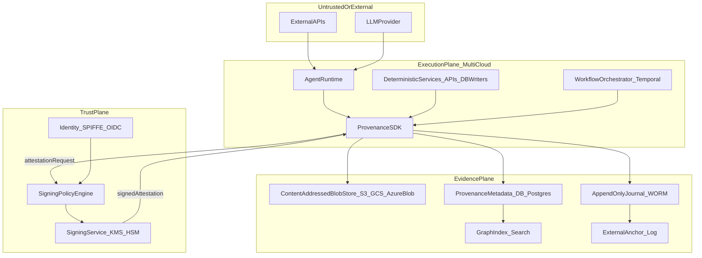
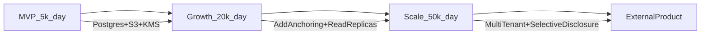

# Provenance & Auditability System Design (AI-Driven Investment Platform)

## 1. Executive Summary (Investor Lens)

- **Turns “AI did it” into a defensible asset**: Converts agentic decision-making from a compliance liability into an LP-grade, regulator-ready differentiator—every memo, dataset, and CRM change is attributable, tamper-evident, and explainable.
- **De-risks scale and multi-cloud**: A cryptographic provenance layer decouples “trust” from any single cloud, database, or vendor. If infrastructure changes, historical proofs remain verifiable.
- **Reduces the blast radius of model drift**: When models change behavior, you can prove what changed (inputs, model, prompt, tools, environment) and which decisions were affected—critical for incident response and LP communications.
- **Creates a monetizable capability**: The same infrastructure can be packaged as “verifiable diligence / audit exports” for co-investors, SPVs, fund admins, or portfolio companies.
- **Key differentiator (non-obvious design decision)**: **A “Determinism Firewall” + dual-ledger anchoring**.
  - **Determinism firewall**: deterministic steps are replayable/idempotent; non-deterministic AI steps are treated as *signed observations* with explicit attempt semantics (no silent retries).
  - **Dual-ledger anchoring**: internal Merkle-DAG + append-only journal, periodically anchored to an external transparency log (and optionally cosigned by independent witnesses) to make insider tampering detectable and reputationally costly.
- **Audit responses become proof-bearing**: Every audit query returns a compact proof bundle that an external auditor can verify offline, minimizing “trust Soma’s API.”

## 2. High-Level Architecture

### 2.1 Core components (opinionated)

- **Agent Runtime**: containerized agents + tool-calling proxies (LLM providers, browser, data APIs). Runs in any cloud.
- **Workflow Orchestrator (buy)**: **Temporal** (preferred) or similar durable engine. Deterministic workflow code; activities encapsulate side effects.
- **Provenance SDK (build)**: a library embedded in services/agents to standardize artifact capture, hashing, and attestation creation.
- **Signing Service (buy primitives + thin build)**: cloud KMS/HSM-backed signer behind a policy engine; supports Ed25519/ECDSA signatures, key rotation, and delegation.
- **Provenance Store (build on primitives)**:
  - **Merkle-DAG store** (content-addressed): artifacts + claims + edges.
  - **Append-only journal** (WORM semantics): ordered event log with hash chaining.
- **Identity System (buy)**: **SPIFFE/SPIRE** for workload identities + OIDC for humans; maps to signing identities.
- **Audit Query System (build)**: lineage graph service + proof generator + export formats.
- **Anchoring/Witnessing (hybrid)**:
  - External anchor: **Sigstore Rekor**, Certificate Transparency-style log, or a partner-operated transparency service.
  - Optional: 3-of-5 **witness cosigners** (can be separate clouds/tenants) for high-assurance periods.

### 2.2 Data flow (clear boundaries)

### 2.3 Trust boundaries

- **Execution plane is not trusted for persistence**: agents/services can be compromised; they submit evidence but cannot rewrite history.
- **Trust plane is the cryptographic choke point**: only the signing service can mint valid attestations under Soma identities.
- **Evidence plane is append-only + independently verifiable**: storage compromise is detectable via hashes/signatures + external anchoring.

### 2.4 Storage layers (hot/cold, structured/blob)

- **Hot (30-90d)**:
  - Metadata/edges in **PostgreSQL** (or Aurora/Postgres) for fast lineage queries.
  - Recent artifacts in object storage with versioning.
  - Optional **Redis** for caching lineage subgraphs.
- **Warm (90d-1y)**:
  - Metadata stays queryable (partitioned Postgres / read replicas).
  - Blobs in object storage IA tiers.
- **Cold (1y-7y+)**:
  - Journal checkpoints + proof bundles in archive storage.
  - Periodic snapshot exports for regulatory retention.

### 2.5 Where cryptographic guarantees are enforced

- **At artifact creation**: hash + canonicalization + content-addressing.
- **At commit points**: signed attestations covering inputs, outputs, environment, and workflow context.
- **At the journal**: hash-chained append-only entries; periodic anchor of journal head.
- **At query time**: proofs verify signatures, hash links, revocation status, and anchor inclusion.

### 2.6 Build vs buy (strong opinions)

- **Buy**:
  - **Temporal** for durable orchestration.
  - **SPIFFE/SPIRE** for workload identity.
  - **Cloud KMS/HSM** for keys + audit logs.
  - Object storage for blobs.
- **Build**:
  - Provenance SDK, Merkle-DAG model, proof bundling, audit query semantics.
  - Thin signing policy layer (what is allowed to be signed, by whom, under what conditions).
- **Avoid**:
  - Full blockchain platforms for core storage (overkill, expensive, awkward privacy/compliance); use anchoring instead.

### 2.7 Real-world analogs (credibility mapping)

- **Temporal**: durable orchestration for retries, timers, and long-running workflows maps directly to our deterministic execution lane.
- **Sigstore Rekor / Certificate Transparency logs**: model for externally auditable append-only logs and anchoring.
- **SPIFFE/SPIRE**: production pattern for short-lived workload identities across clusters/clouds.
- **in-toto / SLSA provenance**: attestation-oriented supply-chain model analogous to artifact lineage attestations in this system.
- **Cloud KMS/HSMs (AWS/GCP/Azure)**: mature key custody and audit logging primitives behind our signing service.

## 3. Core Design: Provenance System (Deep Dive)

### 3.1 Design goals

- **Tamper evidence**: any change to content or claimed lineage breaks verification.
- **Composable lineage**: artifacts link to upstream artifacts by hash (not mutable IDs).
- **Auditor-friendly proofs**: compact bundles reconstructable offline.
- **Cross-cloud portability**: evidence survives infra migrations.

### 3.2 Verifiable model: Merkle-DAG + signed attestations + journal anchoring

Model everything as content-addressed nodes in a DAG:
- **Artifact node**: immutable blob (memo text, JSON dataset, email draft, CRM patch).
- **Attestation node**: a signed statement about an action that produced/used artifacts.
- **Edge**: child attestation references parent artifact hashes; output artifacts reference producing attestation.
- **Journal**: total order of attestations/events for time-based audits; each entry commits to the previous.

Key concept: IDs are derived from content (CIDs), not databases.
- Use canonical encoding (for example JSON Canonicalization Scheme) before hashing.
- Hash algorithm: SHA-256 (BLAKE3 possible if throughput becomes the bottleneck).

### 3.3 Data model (nodes, edges, metadata)

**Artifact (content-addressed)**
- `artifact_cid = H(canonical_bytes)`
- Stored in blob store under key = `artifact_cid`.
- Metadata stored separately for indexing.

**Attestation (signed)**
- `attestation_cid = H(canonical_attestation_payload)`
- `signature = Sign(attestation_cid, signer_private_key)`

Attestation payload (conceptual):
- `subject`: output artifact CID(s)
- `inputs`: list of input artifact CIDs + roles
- `actor`: agent/human identity + cert chain reference
- `workflow`: `workflow_id`, `run_id`, `step_id`, `attempt_id`
- `determinism`: `deterministic | nondeterministic`
- `environment`: code hash, container image digest, config hash
- `time`: monotonic timestamp + optional external time witness
- `external_calls`: digests of requests/responses

**Edges**
- `USED(input_artifact_cid -> attestation_cid)`
- `GENERATED(attestation_cid -> output_artifact_cid)`
- `DERIVED_FROM(output_artifact_cid -> input_artifact_cid)` (materialized for fast lineage)

### 3.4 How artifacts are created, hashed, and linked

1. **Capture bytes**: exact artifact content (including raw LLM response JSON where feasible).
2. **Canonicalize**:
   - JSON: JCS; text: UTF-8 normalized; PDFs: store original bytes and parsed-text derivative as separate artifacts.
3. **Hash**: compute CID.
4. **Store blob**: write to CAS bucket (versioned). Storage must reject overwrite by key.
5. **Create attestation** linking:
   - Inputs: previous artifact CIDs
   - Outputs: new artifact CID(s)
   - Context: who/what/when/how
6. **Sign**: send attestation payload to signing service; receive signature + cert chain.
7. **Append journal**: write journal entry containing `attestation_cid`, signature, previous journal hash.
8. **Index**: write metadata/edges to Postgres + graph index.

### 3.5 How modifications are detected

- If blob content changes: CID changes, but existing attestations still point to old CID -> mismatch.
- If metadata/edges are altered in DB: recomputing proofs from blobs + attestations fails.
- If journal is rewritten: hash chain breaks and anchor mismatches.

### 3.6 How lineage is reconstructed

- Start from a root artifact (for example, `InvestmentDecision` for Company X).
- Traverse upstream via `inputs` in attestations and `DERIVED_FROM` edges.
- For each hop, verify:
  - blob hash matches CID
  - attestation hash matches payload
  - signature verifies under identity chain
  - key was not revoked at signing time
  - journal inclusion + anchor consistency

### 3.7 Example walk-through: investment memo creation

Scenario: produce `Memo_v1`, then human approves to `Memo_final`.
1. `CompanyProfile_v3` exists.
2. Deterministic enrichment produces `EnrichedData_v5`.
   - Attestation `A_enrich` signs: inputs=`CompanyProfile_v3`, external API response digests, output=`EnrichedData_v5`.
3. LLM generation produces `MemoDraft_v1`.
   - Attestation `A_llm_generate` signs: inputs=`EnrichedData_v5`, prompt template CID, tool transcript CID, output=`MemoDraft_v1`, determinism=`nondeterministic`.
4. Human edits/approves to `Memo_final`.
   - Attestation `A_human_approve` signs: inputs=`MemoDraft_v1`, output=`Memo_final`, reason code + reviewer identity.

Audit query: "Why invest in Company X?"
- Root: `Decision_X` artifact.
- Lineage: `Memo_final -> MemoDraft_v1 -> EnrichedData_v5 -> sources`.
- Proof bundle includes CIDs + signatures + anchored journal heads for timeframe.

## 4. Workflow Orchestration System

### 4.1 Requirements mapping

- **Retries/failures/long-running**: Temporal workflows + activity retries.
- **Preserve provenance across retries**: every attempt gets `attempt_id`, producing either no artifact or an explicitly labeled partial artifact.
- **Deterministic vs non-deterministic separation**: enforce in workflow policy/type system.

### 4.2 Temporal vs DAG engine vs event sourcing

- **Recommendation: Temporal**
  - Pros: durable state, strong retry semantics, timers, long workflows, explicit activity boundaries, replay model.
  - Cons: requires discipline around non-determinism in workflow logic.
- **Complement with event sourcing** for audit (journal), not execution.

### 4.3 Checkpointing strategy

- Each workflow step emits a **StepAttestation** when producing an output artifact.
- Deterministic steps include an idempotency fingerprint:
  - `fingerprint = H(workflow_step + sorted(input_cids) + params + code_hash)`
  - On retry with same fingerprint:
    - reuse previous output CID (preferred), or
    - emit conflict attestation (rare, alerting path).

### 4.4 Preserving provenance across retries

- Every attempt emits:
  - `AttemptStarted` journal entry
  - optional `PartialOutputCaptured` artifact + attestation
  - `AttemptSucceeded` with output CID(s) or `AttemptFailed` with error digest

### 4.5 Deterministic replay vs best-effort reproducibility

- **Deterministic steps**: replayable in principle; at minimum idempotent outputs.
- **LLM steps**: not replayable; optimize for verifiable capture, not reproduction.

## 5. Identity & Trust Model

### 5.1 Identities

- **Humans**: OIDC + hardware-backed keys (FIDO2/WebAuthn or managed certs). Human approvals are first-class attestations.
- **Agents/workloads**: SPIFFE identities (for example `spiffe://soma/agents/analyzer/v2`) minted at runtime.

### 5.2 Signing model (what gets signed, when)

- Sign **attestations**, not raw blobs.
- Required signatures:
  - artifact creation influencing investment decisions (memos, enriched datasets, CRM writes, decisions)
  - external API call digests used as evidence
  - approval/override/escalation decisions

### 5.3 Key management

- **Root of trust**: org CA / KMS root; keys never leave HSM.
- **Workload signing keys**: short-lived (minutes/hours), issued to SPIFFE identities, used through remote signer.
- **Rotation**: continuous via short-lived keys + periodic CA rotation.
- **Revocation**:
  - publish revocation lists and include signing-time validity in proofs
  - historical signatures stay verifiable but flagged if later-revoked key was used

### 5.4 Delegation

- Signed delegation tokens:
  - `issuer` delegates to `delegatee` with bounded scope (workflow, artifact types, max artifacts, TTL)
  - token CID included in derived attestations

### 5.5 Threat model (explicit)

- **Insider DB tampering**: mitigated by signatures over lineage + journal hash chain + external anchoring.
- **Compromised runtime**: can produce bad outputs, but cannot forge identity outside signing policy.
- **API poisoning/data drift**: cannot prove external truth, but can prove what was observed and what decisions consumed it.
- **LLM provider disputes**: retain raw responses + provider request IDs; optionally add witness cosigners.

## 6. Audit Query Layer

### 6.1 Storage model: hybrid (graph + journal)

- **Graph for lineage**: Postgres nodes/edges now; graph DB optional later.
- **Journal for timeline**: append-only record for temporal completeness proofs.

### 6.2 Query interfaces

- **Audit API** (internal): GraphQL/REST + strict RBAC + query logging.
- **External export**: proof bundle (JSON + blobs) verifiable offline.

### 6.3 Query execution strategy

1. Resolve "Company X" to root artifacts via index.
2. Bounded upstream graph traversal with cache reuse.
3. Generate proof on demand including attestations, CIDs, signatures, cert snapshots, inclusion proofs, and anchor receipts.

### 6.4 Indexing

- Index by `company_id`, `artifact_type`, `created_at`, `actor_id`, `workflow_id`.
- Maintain reverse-edge lookup for downstream impact analysis.
- Time-partition for growth to 50k actions/day.

### 6.5 Proof generation (for external auditors)

A proof bundle must enable:
- signature verification for every attestation
- blob re-hashing against CID
- DAG edge reconstruction
- journal chain + anchor receipt validation
- key validity checks at signing time

### 6.6 Completeness proofs (no silent omission)

To answer "how do we know records were not omitted," the audit system provides interval completeness semantics:

- **Interval definition**: an audit interval is bounded by two anchored journal checkpoints:
  - `checkpoint_start = (seq_start, journal_head_start, anchor_receipt_start)`
  - `checkpoint_end = (seq_end, journal_head_end, anchor_receipt_end)`
- **Monotonic sequencing**: every journal entry has a strictly increasing `seq_no` and `prev_entry_hash`.
- **Completeness condition**: an interval is complete iff:
  - all `seq_no` in `[seq_start, seq_end]` are present with no gaps
  - each `prev_entry_hash` links correctly
  - start/end heads verify against external anchor receipts
- **Proof bundle additions**:
  - sequence manifest (min/max seq, count, hash root of included entries)
  - inclusion proofs for queried events
  - consistency proof between start/end anchor states

This prevents returning a "clean" subgraph while hiding adverse events in the same interval.

## 7. Handling Non-Deterministic AI

### 7.1 Why LLM outputs break reproducibility

Sampling, model/provider evolution, tool nondeterminism, context truncation, and hidden provider behavior make "re-run and reproduce" unreliable.

### 7.2 Core principle

Do not promise reproducibility; promise verifiable capture + attribution.

### 7.3 How to wrap LLM steps with deterministic guarantees

For every LLM step, content-address and retain:
- **Inputs**:
  - system prompt CID
  - user prompt CID
  - context artifact CIDs (documents/templates)
  - allowed-tool schema CID
- **Execution metadata**:
  - provider, model version, params (`temperature`, `top_p`, `max_tokens`), request ID
  - truncation indicators, token counts
  - code hash + policy version
- **Tool transcript**:
  - ordered tool args/results as artifacts; transcript CID
- **Outputs**:
  - raw provider response artifact (where possible)
  - extracted final text/JSON artifact

Then sign a single **LLMExecutionAttestation** linking all of the above.

### 7.4 Retries and ambiguity (strong rule)

- Never silently retry an LLM step that could change meaning.
  - **Class A (transport/pre-token failure)**: one automatic visible retry allowed with a new `attempt_id` and same input CIDs.
  - **Class B (partial output emitted)**: persist partial artifact; no silent retry; require human escalation or explicit "regeneration" attempt.
  - **Class C (semantic-critical outputs: investment recommendation/decision support)**: no automatic retry after model response starts; explicit reviewer approval required before downstream use.

### 7.5 Optional verification / consensus strategies

- **Dual-run for high stakes**: two models (or two runs) with rubric-based agreement/human adjudication.
- **Verifier agents**: secondary model checks claims against source artifacts and signs a `VerificationAttestation`.
- **Quorum cosigning**: require human + compliance cosignature on final memos/decisions.

## 8. Tradeoffs (Investor-Grade)

### 8.1 What this design optimizes for

- Integrity + non-repudiation over raw speed.
- Audit clarity over false promises of reproducibility.
- Multi-cloud portability of trust guarantees.

### 8.2 What it sacrifices

- Higher storage + latency overhead from proof-grade capture.
- Tighter developer constraints from provenance policy.

### 8.3 Simpler alternatives rejected

- **Just logs**: easy to tamper, weak completeness guarantees.
- **Just blockchain**: expensive, privacy/compliance friction, poor operational fit.
- **Force determinism in LLMs**: brittle and misleading under provider/model drift.

### 8.4 Cost vs trust posture

Start with Postgres + object storage + KMS signer. Add anchoring cadence and witness cosigners only for high-regulatory or LP-critical flows.

### 8.5 Additional tradeoffs (practical operations)

- **Integrity vs latency**: signing, hashing, and verification on every material action adds overhead to write/read paths.
- **Proof completeness vs storage**: retaining raw prompts, tool transcripts, and provider payloads improves defensibility but increases storage costs significantly.
- **Anchoring frequency vs cost**: hourly anchoring reduces tamper-detection windows vs daily anchoring, but increases operational and compute cost.
- **Strict provenance policy vs developer velocity**: mandatory attestation gates reduce silent failures but can slow feature delivery and experimentation.
- **Data minimization/privacy vs audit depth**: comprehensive evidence capture improves audits but expands legal/privacy handling obligations.
- **Centralized signer simplicity vs blast radius**: a single signing plane is easier to operate, but becomes a critical dependency for system availability.
- **Human review quality vs automation throughput**: escalation on ambiguous LLM outcomes improves trust and auditability but lowers end-to-end automation.
- **Managed services speed vs cloud portability**: cloud-native managed components accelerate time-to-market but require abstraction discipline to avoid lock-in.

### 8.6 Cost envelopes (order-of-magnitude)

Approximate monthly ranges (infrastructure only; excludes people costs):

- **At 5k actions/day (MVP posture)**:
  - Storage (metadata + blobs + retention): low four figures
  - Signing/KMS + key ops: low three to low four figures
  - Query + orchestration + cache: low four figures
  - **Total**: roughly low-to-mid four figures/month
- **At 50k actions/day (scaled posture)**:
  - Storage/retention and proof export bandwidth dominate
  - Higher anchoring cadence + read replicas + analytics tier
  - **Total**: high four to low five figures/month, depending on retention depth and proof export volume

Primary spend drivers: raw artifact retention policy, anchoring cadence, and frequency/size of external proof generation.

## 9. Evolution Over Time

### 9.1 At 10x scale (50k actions/day)

- Partition provenance tables by time/workflow.
- Add read replicas + lineage cache.
- Use ClickHouse for heavy compliance analytics.
- Add async proof-generation jobs for large exports.

### 9.2 With stricter regulation

- Enforce stronger WORM/object-lock retention.
- Require multi-party approvals on sensitive artifact classes.
- Increase anchor cadence (for example hourly) + witness quorum for investment decisions.
- Map controls to SOC2/ISO27001 evidence.

### 9.3 If exposed as a product

- Tenant-isolated trust roots and evidence stores.
- Selective disclosure proof exports (subgraph redaction + re-signing); consider ZK over time.
- Standardize attestation formats (in-toto/SLSA-aligned, Sigstore-compatible).

### 9.4 Multi-cloud failure policy (fail-open vs fail-closed)

- **Signer unavailable**:
  - Investment-critical steps: **fail-closed** (no unsigned decision-path artifacts).
  - Non-critical enrichment/preview steps: **fail-open to quarantine** (store unsigned provisional artifacts; cannot promote downstream).
- **Anchor service unavailable**:
  - Continue journal appends locally with incident flag; anchor backlog when service recovers.
  - External proofs during outage include "anchor pending" status and reduced assurance marker.
- **Region isolation/network partition**:
  - Single writer per workflow run; cross-region readers served stale-safe data.
  - No multi-writer merge for journal sequence numbers.
- **Clock skew**:
  - Use monotonic sequence and signer timestamp as source of truth; wall-clock only informational.

## 10. Presentation Checklist (what to include in writing/slides)

## 10. Presentation Checklist (what to include in writing/slides)

- **Problem and stakes**: AI-agent productivity upside and LP/regulatory downside if lineage is not cryptographically trustworthy.
- **Design thesis**: the determinism firewall + dual-ledger anchoring as the core non-obvious decision.
- **System architecture**: components, trust boundaries, and where cryptographic guarantees are enforced.
- **Deep dive**: artifact + attestation + journal model with a concrete lineage walkthrough for a single investment decision.
- **Audit query example**: "Show every action and source for Company X" plus what is verified in the proof bundle.
- **Identity/security posture**: signing model, key lifecycle, delegation, and threat model assumptions.
- **Tradeoffs and roadmap**: what was optimized, what was sacrificed, and phased evolution from 5k to 50k actions/day.

## 11. Implementation hardening addendum

### 11.1 Data classification, redaction, and privacy boundaries

Define artifact classes and retention/access policy:

- **Class A (public/low sensitivity)**: generic market metadata; full retention allowed.
- **Class B (internal confidential)**: investment memos, scoring outputs; encrypted at rest, RBAC-scoped.
- **Class C (sensitive/PII/secrets-adjacent)**: raw prompts containing personal data, tool outputs with credentials, API payload fragments.

Controls for Class C:
- pre-persist redaction pipeline (secret detectors + policy regex/classifier)
- tokenize sensitive fields before indexing
- store full raw payload only in restricted vault bucket; index stores hashed/tokenized pointers
- separate encryption keys and stricter access audit logs

Rule: proofs include hashes for restricted blobs; full plaintext only disclosed to authorized reviewers.

### 11.2 Schema/versioning and canonicalization contract

All attestations include:
- `attestation_type`
- `attestation_version`
- `canonicalization_version`

Compatibility policy:
- backward-compatible readers for at least two major versions
- no destructive field reuse; deprecate with explicit sunset windows
- migration jobs emit `MigrationAttestation` linking old/new CIDs

Canonicalization requirements:
- deterministic JSON field ordering
- fixed float and timestamp normalization
- explicit UTF-8 normalization for text artifacts

### 11.3 Audit SLOs and query classes

Target SLOs:
- **Q1 Integrity check (single artifact)**: p95 < 2s
- **Q2 Decision lineage (typical case)**: p95 < 60s
- **Q3 Full proof export (large interval)**: p95 < 5m (async allowed)

Storage-tier behavior:
- hot tier serves synchronous queries
- warm tier may incur object fetch latency
- cold tier uses async export with retrieval notification

### 11.4 Control-to-evidence mapping (LP/regulatory readiness)

Examples:
- **Control**: every decision artifact must be attributable.
  - **Mechanism**: mandatory signed attestation + identity chain verification.
  - **Evidence**: signature verification report + signer certificate snapshot.
- **Control**: no silent post-hoc modification.
  - **Mechanism**: content addressing + journal hash chain + anchor receipts.
  - **Evidence**: recomputed CID match + chain consistency proof.
- **Control**: key compromise response.
  - **Mechanism**: revocation list publication + incident policy.
  - **Evidence**: revocation event, affected artifact list, remediation attestations.

### 11.5 Key compromise and incident runbook

Incident phases:
1. **Detect**: anomaly triggers from signing pattern/rate/location drift.
2. **Contain**: freeze delegated scopes, block critical promotions, switch high-risk flows to human-approval-only mode.
3. **Revoke**: publish revocation and propagate validator updates.
4. **Assess blast radius**: enumerate artifacts signed in affected window by `signer_id + time`.
5. **Remediate**: re-run deterministic steps where needed; attach `RemediationAttestation`.
6. **Close-out**: incident report with proof bundle and policy changes.

### 11.6 External API trust scoring and source quality policy

Because external truth is not guaranteed, each source observation carries a trust score:
- `source_identity_confidence` (signed/authenticated endpoint vs anonymous scrape)
- `freshness_score` (age vs policy threshold)
- `consistency_score` (agreement with alternate sources)

Policy usage:
- low trust-score observations cannot directly drive investment recommendation artifacts without human override attestation
- conflicting high-impact data triggers multi-source reconciliation workflow
